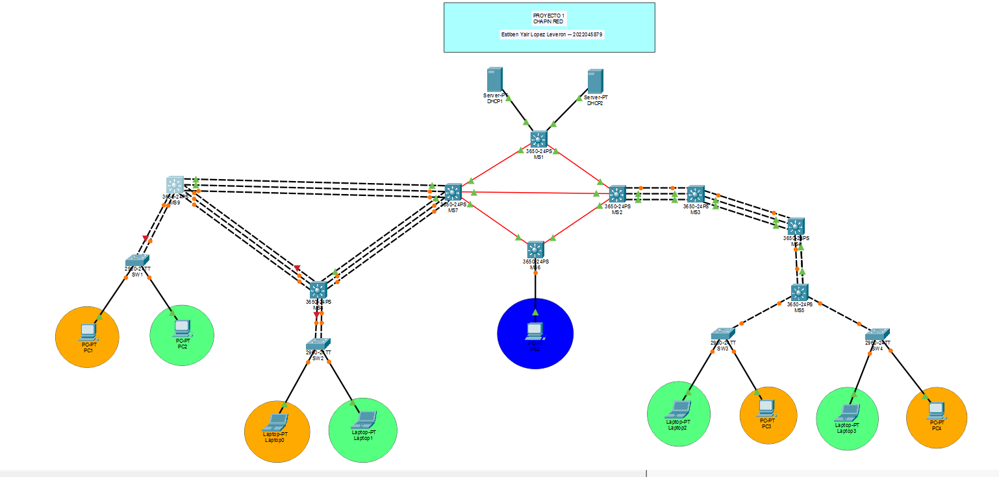
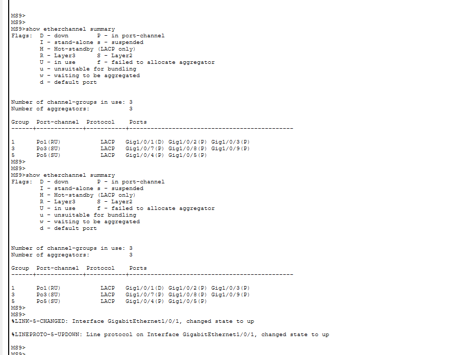
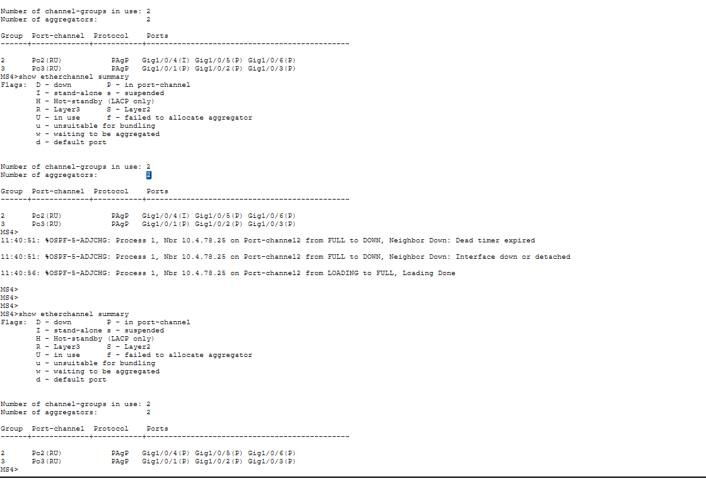

# Manual Técnico — Proyecto 1: Chapin Red
### Redes de Computadoras 2 | Universidad San Carlos de Guatemala
### Facultad de Ingeniería — Ingeniería en Ciencias y Sistemas

| Campo | Detalle |
|-------|---------|
| **Estudiante** | Estiben Yair López Leverón |
| **Carné** | 202204578 |
| **Curso** | Redes de Computadoras 2 |
| **Semestre** | 1S 2026 |
| **Protocolo de Enrutamiento** | OSPF (carné par) |

---

## Índice

1. [Descripción del Proyecto](#1-descripción-del-proyecto)
2. [Topología de Red](#2-topología-de-red)
3. [Planificación y Subnetting](#3-planificación-y-subnetting)
4. [VLANs](#4-vlans)
5. [VTP — VLAN Trunking Protocol](#5-vtp--vlan-trunking-protocol)
6. [Configuración de Trunks](#6-configuración-de-trunks)
7. [Agregación de Enlaces (LACP y PAgP)](#7-agregación-de-enlaces-lacp-y-pagp)
8. [Interfaces de Capa 3 (SVIs)](#8-interfaces-de-capa-3-svis)
9. [Enrutamiento Dinámico (OSPF)](#9-enrutamiento-dinámico-ospf)
10. [DHCP](#10-dhcp)
11. [ACLs — Control de Acceso](#11-acls--control-de-acceso)
12. [Spanning Tree Protocol (STP)](#12-spanning-tree-protocol-stp)
13. [Comandos de Verificación](#13-comandos-de-verificación)

---

## 1. Descripción del Proyecto

**Chapin Red** es una empresa dedicada a proyectos de ayuda humanitaria que opera desde cuatro edificios distribuidos geográficamente dentro de una misma área metropolitana.

El objetivo del proyecto es diseñar e implementar una **infraestructura de red corporativa multi-edificio** utilizando **Cisco Packet Tracer**, aplicando los siguientes conceptos:

- Arquitectura jerárquica de tres capas (Core, Distribución, Acceso)
- Segmentación mediante VLANs
- Agregación de enlaces con LACP y PAgP
- Enrutamiento dinámico con OSPF (carné par: 202204578)
- Servidores DHCP centralizados con relay
- Políticas de seguridad con ACLs
- Conexión MAN entre los cuatro edificios

---

## 2. Topología de Red



### Dispositivos utilizados

| Switch | Modelo | Rol | Edificio |
|--------|--------|-----|----------|
| MS1 | Cisco 3650-24PS | Switch Central MAN | Central |
| MS7 | Cisco 3650-24PS | Switch MAN Izquierdo | Izquierdo |
| MS2 | Cisco 3650-24PS | Switch MAN Derecho | Derecho |
| MS6 | Cisco 3650-24PS | Switch MAN Admin | Administración |
| MS9 | Cisco 3560-24PS | Core — gateway SW1 | Izquierdo |
| MS8 | Cisco 3560-24PS | Distribución — gateway SW2 | Izquierdo |
| MS3 | Cisco 3650-24PS | Core/Distribución | Derecho |
| MS4 | Cisco 3560-24PS | Distribución | Derecho |
| MS5 | Cisco 3560-24PS | Distribución — gateway SW3/SW4 | Derecho |
| SW1 | Cisco 2960-24TT | Acceso | Izquierdo |
| SW2 | Cisco 2960-24TT | Acceso | Izquierdo |
| SW3 | Cisco 2960-24TT | Acceso | Derecho |
| SW4 | Cisco 2960-24TT | Acceso | Derecho |

### Servidores

| Servidor | IP | Gateway | Conectado a | VLAN |
|----------|-----|---------|-------------|------|
| DHCP1 | 192.188.78.130/28 | 192.188.78.142 | MS1 Gig1/0/1 | 99 |
| DHCP2 | 192.188.78.131/28 | 192.188.78.142 | MS1 Gig1/0/2 | 99 |

---

## 3. Planificación y Subnetting

### Redes base asignadas

Los últimos dos dígitos del carné **202204578** son **78**, por lo tanto:

| Red | Dirección | Uso |
|-----|-----------|-----|
| Red VLANs | `192.188.78.0/24` | VLANs de usuarios |
| Red Routing | `10.4.78.0/24` | Enlaces punto a punto entre switches |

---

### Parte A — Subnetting de VLANs (VLSM): `192.188.78.0/24`

Se aplicó **VLSM** para dividir la red en 5 subredes optimizadas:

**Cálculo /27 (VLANs grandes):**
```
Bits de host = 32 - 27 = 5 bits
Total IPs    = 2⁵ = 32
Hosts útiles = 32 - 2 = 30 hosts
Máscara      = 255.255.255.224
```

**Cálculo /28 (VLAN ADMIN):**
```
Bits de host = 32 - 28 = 4 bits
Total IPs    = 2⁴ = 16
Hosts útiles = 16 - 2 = 14 hosts
Máscara      = 255.255.255.240
```

| # | VLAN | Red | Máscara | Gateway | Rango DHCP | Broadcast | Hosts |
|---|------|-----|---------|---------|------------|-----------|-------|
| 1 | VLAN 10 — Naranja IZQ | 192.188.78.0/27 | 255.255.255.224 | 192.188.78.1 | .3 → .30 | 192.188.78.31 | 30 |
| 2 | VLAN 20 — Verde IZQ | 192.188.78.32/27 | 255.255.255.224 | 192.188.78.33 | .35 → .62 | 192.188.78.63 | 30 |
| 3 | VLAN 30 — Naranja DER | 192.188.78.64/27 | 255.255.255.224 | 192.188.78.65 | .66 → .94 | 192.188.78.95 | 30 |
| 4 | VLAN 40 — Verde DER | 192.188.78.96/27 | 255.255.255.224 | 192.188.78.97 | .98 → .126 | 192.188.78.127 | 30 |
| 5 | VLAN 99 — ADMIN | 192.188.78.128/28 | 255.255.255.240 | 192.188.78.129 | .132 → .142 | 192.188.78.143 | 14 |

> **Nota:** Las IPs .129 (MS6), .130 (DHCP1), .131 (DHCP2), .142 (MS1) están reservadas para infraestructura.

---

### Parte B — Subnetting de enlaces (/30): `10.4.78.0/24`

**Cálculo /30:**
```
Bits de host = 32 - 30 = 2 bits
Total IPs    = 2² = 4
Hosts útiles = 4 - 2 = 2 hosts
Máscara      = 255.255.255.252
```

| # | Enlace | Red | IP Lado A | IP Lado B | Broadcast |
|---|--------|-----|-----------|-----------|-----------|
| 1 | MS1 ↔ MS7 | 10.4.78.0/30 | 10.4.78.1 (MS1) | 10.4.78.2 (MS7) | 10.4.78.3 |
| 2 | MS1 ↔ MS2 | 10.4.78.4/30 | 10.4.78.5 (MS1) | 10.4.78.6 (MS2) | 10.4.78.7 |
| 3 | MS7 ↔ MS2 | 10.4.78.8/30 | 10.4.78.9 (MS7) | 10.4.78.10 (MS2) | 10.4.78.11 |
| 4 | MS7 ↔ MS6 | 10.4.78.12/30 | 10.4.78.13 (MS7) | 10.4.78.14 (MS6) | 10.4.78.15 |
| 5 | MS2 ↔ MS6 | 10.4.78.16/30 | 10.4.78.17 (MS2) | 10.4.78.18 (MS6) | 10.4.78.19 |
| 6 | MS2 ↔ MS3 (Po1) | 10.4.78.20/30 | 10.4.78.21 (MS2) | 10.4.78.22 (MS3) | 10.4.78.23 |
| 7 | MS3 ↔ MS4 (Po2) | 10.4.78.24/30 | 10.4.78.25 (MS3) | 10.4.78.26 (MS4) | 10.4.78.27 |
| 8 | MS4 ↔ MS5 (Po3) | 10.4.78.28/30 | 10.4.78.29 (MS4) | 10.4.78.30 (MS5) | 10.4.78.31 |
| 9 | MS7 ↔ MS9 (Po1) | 10.4.78.32/30 | 10.4.78.33 (MS7) | 10.4.78.34 (MS9) | 10.4.78.35 |
| 10 | MS7 ↔ MS8 (Po2) | 10.4.78.36/30 | 10.4.78.37 (MS7) | 10.4.78.38 (MS8) | 10.4.78.39 |
| 11 | MS9 ↔ MS8 (Po3) | 10.4.78.40/30 | 10.4.78.41 (MS9) | 10.4.78.42 (MS8) | 10.4.78.43 |
| 12 | MS1 ↔ DHCP1 | 10.4.78.48/30 | 10.4.78.49 (MS1) | 10.4.78.50 (DHCP1) | 10.4.78.51 |
| 13 | MS1 ↔ DHCP2 | 10.4.78.52/30 | 10.4.78.53 (MS1) | 10.4.78.54 (DHCP2) | 10.4.78.55 |

---

## 4. VLANs

### Nomenclatura

Los nombres siguen la convención requerida: `VLAN_[Color]_Edificio[IZQ/DER]_[Carnet]`

| VLAN ID | Nombre | Departamento | Edificio |
|---------|--------|--------------|----------|
| 10 | VLAN_Naranja_EdificioIZQ_202204578 | Proyectos | Izquierdo |
| 20 | VLAN_Verde_EdificioIZQ_202204578 | Coordinación | Izquierdo |
| 30 | VLAN_Naranja_EdificioDER_202204578 | Proyectos | Derecho |
| 40 | VLAN_Verde_EdificioDER_202204578 | Coordinación | Derecho |
| 99 | VLAN_ADMIN_202204578 | Administración | Admin |

### Configuración de VLANs en MS1 (VTP Server)

```
enable
configure terminal

vlan 10
name VLAN_Naranja_EdificioIZQ_202204578
exit

vlan 20
name VLAN_Verde_EdificioIZQ_202204578
exit

vlan 30
name VLAN_Naranja_EdificioDER_202204578
exit

vlan 40
name VLAN_Verde_EdificioDER_202204578
exit

vlan 99
name VLAN_ADMIN_202204578
exit

end
write memory
```

---

## 5. VTP — VLAN Trunking Protocol

VTP sincroniza automáticamente la configuración de VLANs entre todos los switches del dominio.

| Parámetro | Valor |
|-----------|-------|
| Dominio | ChapinRed |
| Contraseña | chapin123 |
| Versión | 2 |

### VTP Server (MS1)

```
enable
configure terminal

vtp mode server
vtp domain ChapinRed
vtp password chapin123
vtp version 2

end
write memory
```

### VTP Client (todos los demás switches)

```
enable
configure terminal

vtp mode client
vtp domain ChapinRed
vtp password chapin123

end
write memory
```

### Verificación

```
show vtp status
show vlan brief
```

---

## 6. Configuración de Trunks

### MS1 — hacia MS7, MS2, DHCP1, DHCP2

```
enable
configure terminal

! Hacia MS7
interface GigabitEthernet1/1/2
no switchport
ip address 10.4.78.1 255.255.255.252
no shutdown
exit

! Hacia MS2
interface GigabitEthernet1/1/1
no switchport
ip address 10.4.78.5 255.255.255.252
no shutdown
exit

! Hacia DHCP1 - acceso VLAN 99
interface GigabitEthernet1/0/1
switchport
switchport mode access
switchport access vlan 99
no shutdown
exit

! Hacia DHCP2 - acceso VLAN 99
interface GigabitEthernet1/0/2
switchport
switchport mode access
switchport access vlan 99
no shutdown
exit

! SVI VLAN 99 para enrutar hacia servidores
interface vlan 99
ip address 192.188.78.142 255.255.255.240
no shutdown
exit

end
write memory
```

### MS7 — hacia MS1, MS2, MS6, MS9 (Po1), MS8 (Po2)

```
enable
configure terminal

! Hacia MS1
interface GigabitEthernet1/1/2
no switchport
ip address 10.4.78.2 255.255.255.252
no shutdown
exit

! Hacia MS2
interface GigabitEthernet1/1/3
no switchport
ip address 10.4.78.9 255.255.255.252
no shutdown
exit

! Hacia MS6
interface GigabitEthernet1/1/1
no switchport
ip address 10.4.78.13 255.255.255.252
no shutdown
exit

end
write memory
```

### MS2 — hacia MS1, MS7, MS6, MS3 (Po1)

```
enable
configure terminal

! Hacia MS1
interface GigabitEthernet1/1/1
no switchport
ip address 10.4.78.6 255.255.255.252
no shutdown
exit

! Hacia MS7
interface GigabitEthernet1/1/3
no switchport
ip address 10.4.78.10 255.255.255.252
no shutdown
exit

! Hacia MS6
interface GigabitEthernet1/1/2
no switchport
ip address 10.4.78.17 255.255.255.252
no shutdown
exit

end
write memory
```

### MS6 — hacia MS7, MS2

```
enable
configure terminal

! Hacia MS7
interface GigabitEthernet1/1/1
no switchport
ip address 10.4.78.14 255.255.255.252
no shutdown
exit

! Hacia MS2
interface GigabitEthernet1/1/2
no switchport
ip address 10.4.78.18 255.255.255.252
no shutdown
exit

! SVI VLAN 99 - gateway del PC Admin
interface vlan 99
ip address 192.188.78.129 255.255.255.240
no shutdown
exit

! Acceso PC Admin en Gig1/0/10
interface GigabitEthernet1/0/10
switchport mode access
switchport access vlan 99
no shutdown
exit

end
write memory
```

### SW1 — Switches de Acceso Izquierdo

```
enable
configure terminal

! PC1 - VLAN 10 (Naranja)
interface FastEthernet0/1
switchport mode access
switchport access vlan 10
spanning-tree portfast
no shutdown
exit

! PC2 - VLAN 20 (Verde)
interface FastEthernet0/2
switchport mode access
switchport access vlan 20
spanning-tree portfast
no shutdown
exit

end
write memory
```

### SW2 — Switch de Acceso Izquierdo

```
enable
configure terminal

! Laptop0 - VLAN 10 (Naranja)
interface FastEthernet0/10
switchport mode access
switchport access vlan 10
spanning-tree portfast
no shutdown
exit

! Laptop1 - VLAN 20 (Verde)
interface FastEthernet0/11
switchport mode access
switchport access vlan 20
spanning-tree portfast
no shutdown
exit

end
write memory
```

### SW3 y SW4 — Switches de Acceso Derecho

```
enable
configure terminal

! Laptop2, PC3 - según color (Naranja VLAN 30, Verde VLAN 40)
interface FastEthernet0/1
switchport mode access
switchport access vlan 30
spanning-tree portfast
no shutdown
exit

interface FastEthernet0/2
switchport mode access
switchport access vlan 40
spanning-tree portfast
no shutdown
exit

end
write memory
```

---

## 7. Agregación de Enlaces (LACP y PAgP)

### LACP — Edificio Izquierdo (5 enlaces)

LACP (IEEE 802.3ad) se configura entre MS7, MS9 y MS8.

#### MS7 — Po1 hacia MS9, Po2 hacia MS8

```
enable
configure terminal

! Po1 hacia MS9 - 3 interfaces
interface range GigabitEthernet1/0/1-3
no switchport
channel-group 1 mode active
no shutdown
exit

interface port-channel 1
no switchport
ip address 10.4.78.33 255.255.255.252
no shutdown
exit

! Po2 hacia MS8 - 3 interfaces
interface range GigabitEthernet1/0/4-6
no switchport
channel-group 2 mode active
no shutdown
exit

interface port-channel 2
no switchport
ip address 10.4.78.37 255.255.255.252
no shutdown
exit

end
write memory
```

#### MS9 — Po1 hacia MS7, Po3 hacia MS8, Po5 hacia SW1

```
enable
configure terminal

! Po1 hacia MS7 - capa 3
interface range GigabitEthernet1/0/1-3
no switchport
channel-group 1 mode active
no shutdown
exit

interface port-channel 1
no switchport
ip address 10.4.78.34 255.255.255.252
no shutdown
exit

! Po3 hacia MS8 - capa 3
interface range GigabitEthernet1/0/7-9
no switchport
channel-group 3 mode active
no shutdown
exit

interface port-channel 3
no switchport
ip address 10.4.78.41 255.255.255.252
no shutdown
exit

! Po5 hacia SW1 - capa 2 trunk
interface range GigabitEthernet1/0/4-5
channel-group 5 mode active
no shutdown
exit

interface port-channel 5
switchport mode trunk
switchport trunk allowed vlan 10,20,30,40,99
no shutdown
exit

end
write memory
```

#### MS8 — Po2 hacia MS7, Po3 hacia MS9, Po4 hacia SW2

```
enable
configure terminal

! Po2 hacia MS7 - capa 3
interface range GigabitEthernet1/0/4-6
no switchport
channel-group 2 mode active
no shutdown
exit

interface port-channel 2
no switchport
ip address 10.4.78.38 255.255.255.252
no shutdown
exit

! Po3 hacia MS9 - capa 3
interface range GigabitEthernet1/0/7-9
no switchport
channel-group 3 mode active
no shutdown
exit

interface port-channel 3
no switchport
ip address 10.4.78.42 255.255.255.252
no shutdown
exit

! Po4 hacia SW2 - capa 2 trunk
interface range GigabitEthernet1/0/1-2
channel-group 4 mode active
no shutdown
exit

interface port-channel 4
switchport mode trunk
switchport trunk allowed vlan 10,20,30,40,99
no shutdown
exit

end
write memory
```

### PAgP — Edificio Derecho (3 enlaces)

PAgP (protocolo propietario Cisco) se configura entre MS2, MS3, MS4 y MS5.

#### MS2 — Po1 hacia MS3

```
enable
configure terminal

interface range GigabitEthernet1/0/1-2
no switchport
channel-group 1 mode desirable
no shutdown
exit

interface port-channel 1
no switchport
ip address 10.4.78.21 255.255.255.252
no shutdown
exit

end
write memory
```

#### MS3 — Po1 hacia MS2, Po2 hacia MS4

```
enable
configure terminal

interface range GigabitEthernet1/0/1-2
no switchport
channel-group 1 mode desirable
no shutdown
exit

interface port-channel 1
no switchport
ip address 10.4.78.22 255.255.255.252
no shutdown
exit

interface range GigabitEthernet1/0/3-4
no switchport
channel-group 2 mode desirable
no shutdown
exit

interface port-channel 2
no switchport
ip address 10.4.78.25 255.255.255.252
no shutdown
exit

end
write memory
```

#### MS4 — Po2 hacia MS3, Po3 hacia MS5

```
enable
configure terminal

interface range GigabitEthernet1/0/1-2
no switchport
channel-group 2 mode desirable
no shutdown
exit

interface port-channel 2
no switchport
ip address 10.4.78.26 255.255.255.252
no shutdown
exit

interface range GigabitEthernet1/0/3-4
no switchport
channel-group 3 mode desirable
no shutdown
exit

interface port-channel 3
no switchport
ip address 10.4.78.29 255.255.255.252
no shutdown
exit

end
write memory
```

#### MS5 — Po3 hacia MS4

```
enable
configure terminal

interface range GigabitEthernet1/0/1-2
no switchport
channel-group 3 mode desirable
no shutdown
exit

interface port-channel 3
no switchport
ip address 10.4.78.30 255.255.255.252
no shutdown
exit

end
write memory
```

### Verificación de EtherChannels

```
show etherchannel summary
show etherchannel detail
```

---

## 8. Interfaces de Capa 3 (SVIs)

Cada switch multicapa que actúa como gateway de una VLAN necesita una SVI (Switched Virtual Interface) con la IP del gateway.

### MS9 — Gateway de SW1 (VLAN 10 y 20)

MS9 está conectado directamente a SW1, por lo que actúa como gateway de PC1 y PC2.

```
enable
configure terminal

ip routing

! Gateway VLAN 10 - Naranja IZQ
interface vlan 10
ip address 192.188.78.1 255.255.255.224
ip helper-address 192.188.78.130
no shutdown
exit

! Gateway VLAN 20 - Verde IZQ
interface vlan 20
ip address 192.188.78.33 255.255.255.224
ip helper-address 192.188.78.130
no shutdown
exit

end
write memory
```

### MS8 — Gateway de SW2 (VLAN 10 y 20)

MS8 está conectado directamente a SW2, por lo que actúa como gateway de Laptop0 y Laptop1.

```
enable
configure terminal

ip routing

! Gateway VLAN 10 - Naranja IZQ (segunda IP de la subred)
interface vlan 10
ip address 192.188.78.2 255.255.255.224
ip helper-address 192.188.78.130
no shutdown
exit

! Gateway VLAN 20 - Verde IZQ (segunda IP de la subred)
interface vlan 20
ip address 192.188.78.34 255.255.255.224
ip helper-address 192.188.78.130
no shutdown
exit

end
write memory
```

### MS5 — Gateway de SW3 y SW4 (VLAN 30 y 40)

```
enable
configure terminal

ip routing

! Gateway VLAN 30 - Naranja DER
interface vlan 30
ip address 192.188.78.65 255.255.255.224
ip helper-address 192.188.78.131
no shutdown
exit

! Gateway VLAN 40 - Verde DER
interface vlan 40
ip address 192.188.78.97 255.255.255.224
ip helper-address 192.188.78.131
no shutdown
exit

end
write memory
```

### MS6 — Gateway de VLAN 99 (Admin)

```
enable
configure terminal

ip routing

! Gateway VLAN 99 - Admin
interface vlan 99
ip address 192.188.78.129 255.255.255.240
ip helper-address 192.188.78.131
no shutdown
exit

end
write memory
```

---

## 9. Enrutamiento Dinámico (OSPF)

Debido a que el carné **202204578 es par**, se utiliza **OSPF** (Open Shortest Path First).

**Wildcard masks utilizadas:**
```
Máscara /30 → wildcard 0.0.0.3
Máscara /27 → wildcard 0.0.0.31
Máscara /28 → wildcard 0.0.0.15
```

### MS1

```
enable
configure terminal

ip routing

router ospf 1
network 10.4.78.0 0.0.0.3 area 0
network 10.4.78.4 0.0.0.3 area 0
network 10.4.78.48 0.0.0.3 area 0
network 10.4.78.52 0.0.0.3 area 0
network 192.188.78.128 0.0.0.15 area 0
exit

end
write memory
```

### MS7

```
enable
configure terminal

ip routing

router ospf 1
network 10.4.78.0 0.0.0.3 area 0
network 10.4.78.8 0.0.0.3 area 0
network 10.4.78.12 0.0.0.3 area 0
network 10.4.78.32 0.0.0.3 area 0
network 10.4.78.36 0.0.0.3 area 0
exit

end
write memory
```

### MS2

```
enable
configure terminal

ip routing

router ospf 1
network 10.4.78.4 0.0.0.3 area 0
network 10.4.78.8 0.0.0.3 area 0
network 10.4.78.16 0.0.0.3 area 0
network 10.4.78.20 0.0.0.3 area 0
exit

end
write memory
```

### MS6

```
enable
configure terminal

ip routing

router ospf 1
network 10.4.78.12 0.0.0.3 area 0
network 10.4.78.16 0.0.0.3 area 0
network 192.188.78.128 0.0.0.15 area 0
exit

end
write memory
```

> ⚠️ **Importante:** MS6 NO debe anunciar `192.188.78.128/28` en OSPF si causa rutas duplicadas hacia los servidores. En ese caso, eliminar esa línea con `no network 192.188.78.128 0.0.0.15 area 0`.

### MS3

```
enable
configure terminal

ip routing

router ospf 1
network 10.4.78.20 0.0.0.3 area 0
network 10.4.78.24 0.0.0.3 area 0
exit

end
write memory
```

### MS4

```
enable
configure terminal

ip routing

router ospf 1
network 10.4.78.24 0.0.0.3 area 0
network 10.4.78.28 0.0.0.3 area 0
exit

end
write memory
```

### MS5

```
enable
configure terminal

ip routing

router ospf 1
network 10.4.78.28 0.0.0.3 area 0
network 192.188.78.64 0.0.0.31 area 0
network 192.188.78.96 0.0.0.31 area 0
exit

end
write memory
```

### MS9

```
enable
configure terminal

ip routing

router ospf 1
network 10.4.78.32 0.0.0.3 area 0
network 10.4.78.40 0.0.0.3 area 0
network 192.188.78.0 0.0.0.31 area 0
network 192.188.78.32 0.0.0.31 area 0
exit

end
write memory
```

### MS8

```
enable
configure terminal

ip routing

router ospf 1
network 10.4.78.36 0.0.0.3 area 0
network 10.4.78.40 0.0.0.3 area 0
network 192.188.78.0 0.0.0.31 area 0
network 192.188.78.32 0.0.0.31 area 0
exit

end
write memory
```

### Verificación OSPF

```
show ip ospf neighbor
show ip route ospf
show ip route
```

---

## 10. DHCP

Se implementaron dos servidores DHCP. Las solicitudes llegan a través del relay configurado en los switches gateway de cada VLAN.

### Servidor DHCP1 — Edificio Izquierdo

**IP estática del servidor** (configurada en Desktop → IP Configuration):
- IPv4: `192.188.78.130`
- Mascara: `255.255.255.240`
- Gateway: `192.188.78.142`
- Conectado a: MS1 Gig1/0/1 (VLAN 99)

**Pools configurados (Services → DHCP):**

| Pool Name | Default Gateway | Start IP | Subnet Mask | Max Users |
|-----------|----------------|----------|-------------|-----------|
| VLAN10_IZQ_MS9 | 192.188.78.1 | 192.188.78.3 | 255.255.255.224 | 14 |
| VLAN10_IZQ_MS8 | 192.188.78.2 | 192.188.78.17 | 255.255.255.224 | 14 |
| VLAN20_IZQ_MS9 | 192.188.78.33 | 192.188.78.35 | 255.255.255.224 | 14 |
| VLAN20_IZQ_MS8 | 192.188.78.34 | 192.188.78.49 | 255.255.255.224 | 14 |

### Servidor DHCP2 — Edificio Derecho

**IP estática del servidor** (configurada en Desktop → IP Configuration):
- IPv4: `192.188.78.131`
- Mascara: `255.255.255.240`
- Gateway: `192.188.78.142`
- Conectado a: MS1 Gig1/0/2 (VLAN 99)

**Pools configurados (Services → DHCP):**

| Pool Name | Default Gateway | Start IP | Subnet Mask | Max Users |
|-----------|----------------|----------|-------------|-----------|
| VLAN30_Naranja_DER | 192.188.78.65 | 192.188.78.66 | 255.255.255.224 | 29 |
| VLAN40_Verde_DER | 192.188.78.97 | 192.188.78.98 | 255.255.255.224 | 29 |
| VLAN99_ADMIN | 192.188.78.129 | 192.188.78.132 | 255.255.255.240 | 11 |

### DHCP Relay (IP Helper)

El relay permite que las solicitudes DHCP de los dispositivos lleguen al servidor aunque estén en diferente subred. Se configura en el switch que tiene la SVI gateway de cada VLAN.

**MS9** — relay para VLAN 10 y 20 hacia DHCP1:

```
enable
configure terminal

interface vlan 10
ip helper-address 192.188.78.130
exit

interface vlan 20
ip helper-address 192.188.78.130
exit

end
write memory
```

**MS8** — relay para VLAN 10 y 20 hacia DHCP1:

```
enable
configure terminal

interface vlan 10
ip helper-address 192.188.78.130
exit

interface vlan 20
ip helper-address 192.188.78.130
exit

end
write memory
```

**MS5** — relay para VLAN 30 y 40 hacia DHCP2:

```
enable
configure terminal

interface vlan 30
ip helper-address 192.188.78.131
exit

interface vlan 40
ip helper-address 192.188.78.131
exit

end
write memory
```

**MS6** — relay para VLAN 99 hacia DHCP2:

```
enable
configure terminal

interface vlan 99
ip helper-address 192.188.78.131
exit

end
write memory
```

### Verificacion DHCP

```
! En dispositivos finales (PCs y Laptops)
ipconfig /renew
ipconfig

! En switches - verificar helper-address y estado de SVI
show ip interface vlan 10
show ip interface vlan 20
show ip interface vlan 30
show ip interface vlan 40
show ip interface vlan 99
```

---
# 11. ACLs --- Control de Acceso

Las ACLs controlan qué tráfico puede pasar entre VLANs, implementando
las políticas de seguridad de Chapin Red.

## Políticas requeridas

  VLAN Origen      VLAN Destino     Permitido
  ---------------- ---------------- ------------------------------------------
  Naranja IZQ      Naranja DER      Permitido
  Naranja          Verde            Bloqueado
  Naranja          ADMIN            Bloqueado
  Verde IZQ        Verde DER        Permitido
  Verde            Naranja          Bloqueado
  Verde            ADMIN            Bloqueado
  ADMIN            Cualquier VLAN   Permitido (puede iniciar)
  Cualquier VLAN   ADMIN            Bloqueado (no puede iniciar hacia ADMIN)

------------------------------------------------------------------------

## Consideraciones de Seguridad

-   **Mínimo privilegio:** se permite únicamente el tráfico
    estrictamente necesario entre VLANs autorizadas.
-   **Especificidad:** cada regla define con precisión la red de origen
    y destino usando wildcard masks.
-   **Documentación:** se utilizan `remark` para explicar cada regla.
-   **Control unidireccional para ADMIN:** VLAN 99 puede iniciar
    comunicación hacia cualquier VLAN, pero no puede recibir conexiones
    iniciadas desde otras VLANs.
-   **Aplicación en el gateway:** las ACLs se aplican en las interfaces
    SVI de los switches multicapa que actúan como gateway.

------------------------------------------------------------------------

# Definición de ACLs

## ACL_NARANJA

Permite comunicación únicamente entre VLAN Naranja de ambos edificios.

    ip access-list extended ACL_NARANJA
     remark Permite trafico de Naranja IZQ hacia Naranja DER
     permit ip 192.188.78.0 0.0.0.31 192.188.78.64 0.0.0.31
     remark Permite trafico de Naranja DER hacia Naranja IZQ
     permit ip 192.188.78.64 0.0.0.31 192.188.78.0 0.0.0.31
     remark Bloquea cualquier otro trafico
     deny ip any any

------------------------------------------------------------------------

## ACL_VERDE

Permite comunicación únicamente entre VLAN Verde de ambos edificios.

    ip access-list extended ACL_VERDE
     remark Permite trafico de Verde IZQ hacia Verde DER
     permit ip 192.188.78.32 0.0.0.31 192.188.78.96 0.0.0.31
     remark Permite trafico de Verde DER hacia Verde IZQ
     permit ip 192.188.78.96 0.0.0.31 192.188.78.32 0.0.0.31
     remark Bloquea cualquier otro trafico
     deny ip any any

------------------------------------------------------------------------

## ACL_ADMIN_IN

Bloquea tráfico iniciado desde cualquier VLAN de usuario hacia la VLAN
ADMIN.

    ip access-list extended ACL_ADMIN_IN
     remark Bloquea acceso desde Naranja IZQ hacia ADMIN
     deny ip 192.188.78.0 0.0.0.31 192.188.78.128 0.0.0.15
     remark Bloquea acceso desde Verde IZQ hacia ADMIN
     deny ip 192.188.78.32 0.0.0.31 192.188.78.128 0.0.0.15
     remark Bloquea acceso desde Naranja DER hacia ADMIN
     deny ip 192.188.78.64 0.0.0.31 192.188.78.128 0.0.0.15
     remark Bloquea acceso desde Verde DER hacia ADMIN
     deny ip 192.188.78.96 0.0.0.31 192.188.78.128 0.0.0.15
     remark Permite trafico iniciado desde ADMIN
     permit ip any any

------------------------------------------------------------------------

# Aplicación de ACLs

## En MS9 (gateway VLAN10 y VLAN20)

    enable
    configure terminal

    interface vlan 10
     ip access-group ACL_NARANJA out
    exit

    interface vlan 20
     ip access-group ACL_VERDE out
    exit

    end
    write memory

------------------------------------------------------------------------

## En MS8 (gateway VLAN10 y VLAN20)

    enable
    configure terminal

    interface vlan 10
     ip access-group ACL_NARANJA out
    exit

    interface vlan 20
     ip access-group ACL_VERDE out
    exit

    end
    write memory

------------------------------------------------------------------------

## En MS5 (gateway VLAN30 y VLAN40)

    enable
    configure terminal

    interface vlan 30
     ip access-group ACL_NARANJA out
    exit

    interface vlan 40
     ip access-group ACL_VERDE out
    exit

    end
    write memory

------------------------------------------------------------------------

## En MS6 (gateway VLAN99 - ADMIN)

    enable
    configure terminal

    interface vlan 99
     ip access-group ACL_ADMIN_IN in
    exit

    end
    write memory


### Pruebas de conectividad esperadas

| Origen | Destino | Resultado esperado |
|--------|---------|-------------------|
| VLAN 10 (Naranja IZQ) | VLAN 30 (Naranja DER) | Ping exitoso |
| VLAN 20 (Verde IZQ) | VLAN 40 (Verde DER) | Ping exitoso |
| VLAN 99 (Admin) | VLAN 10 | Ping exitoso |
| VLAN 99 (Admin) | VLAN 20 | Ping exitoso |
| VLAN 10 (Naranja) | VLAN 20 (Verde) | Ping bloqueado |
| VLAN 10 (Naranja) | VLAN 99 (Admin) | Ping bloqueado |
| VLAN 20 (Verde) | VLAN 99 (Admin) | Ping bloqueado |

### Verificación ACLs

```
show access-lists
show ip interface vlan 10
show ip interface vlan 20
show ip interface vlan 30
show ip interface vlan 40
show ip interface vlan 99
```

---

## 12. Spanning Tree Protocol (STP)

STP previene bucles en capa 2. Se configura en todos los switches de acceso.

```
! En SW1, SW2, SW3, SW4
enable
configure terminal

spanning-tree mode pvst

! Portfast en puertos de dispositivos finales
interface FastEthernet0/1
spanning-tree portfast
exit

end
write memory
```

### Verificación STP

```
show spanning-tree vlan 10
show spanning-tree vlan 20
show spanning-tree vlan 30
show spanning-tree vlan 40
```

---

## 13. Comandos de Verificación

### Comandos generales

| Comando | Descripción |
|---------|-------------|
| `show vtp status` | Verifica configuración VTP |
| `show vlan brief` | Lista todas las VLANs y puertos |
| `show interfaces trunk` | Muestra puertos en modo trunk |
| `show etherchannel summary` | Estado de los EtherChannels |
| `show ip ospf neighbor` | Vecinos OSPF activos |
| `show ip route` | Tabla de enrutamiento completa |
| `show ip interface brief` | Estado de todas las interfaces |
| `show access-lists` | Muestra las ACLs configuradas |
| `show mac address-table` | Tabla de direcciones MAC |
| `show cdp neighbors` | Vecinos CDP conectados |
| `show running-config` | Configuración activa completa |

### Comandos de diagnóstico DHCP

| Comando | Descripción |
|---------|-------------|
| `show ip interface vlan [ID]` | Ver helper-address configurado |
| `ipconfig /renew` | Solicitar IP por DHCP (en PC) |
| `ipconfig` | Ver IP asignada (en PC) |
| `ping [IP]` | Verificar conectividad |
| `show ip route [IP]` | Ver ruta hacia una IP específica |

---

# Pruebas de Tolerancia a Fallos

## Descripción

Para validar la redundancia de los enlaces agregados en la red, se
realizaron pruebas de tolerancia a fallos sobre los EtherChannel
configurados con **LACP**. El objetivo de estas pruebas fue demostrar
que, si uno de los enlaces físicos que forman parte del canal falla o se
desconecta, el **Port-Channel permanece activo** y el tráfico se
redistribuye automáticamente entre los enlaces restantes.

Estas pruebas permiten comprobar que la red mantiene la conectividad y
evita interrupciones en la comunicación, cumpliendo con el principio de
**alta disponibilidad**.

------------------------------------------------------------------------

# Metodología de la prueba

La prueba se realizó siguiendo los siguientes pasos:

1.  Verificar el estado inicial del EtherChannel.
2.  Confirmar que los puertos miembros están agregados correctamente al
    canal.
3.  Realizar pruebas de conectividad entre dispositivos.
4.  Simular una falla física desconectando uno de los enlaces.
5.  Verificar nuevamente el estado del EtherChannel.
6.  Confirmar que la comunicación continúa funcionando.

------------------------------------------------------------------------

# Verificación inicial del EtherChannel

Antes de simular la falla, se verificó el estado de los canales
utilizando el comando:

    show etherchannel summary

Este comando permite identificar: - Los **Port-Channel activos** - El
**protocolo utilizado (LACP o PAgP)** - Los **puertos miembros del
canal** - El **estado de cada enlace**

------------------------------------------------------------------------

# Resultado de la prueba


------------------------------------------------------------------------

# Interpretación del resultado

En el EtherChannel **Po1** se observa lo siguiente:

-   **Gig1/0/1 (D)**\
    El puerto aparece en estado **Down**, lo que indica que el enlace
    fue desconectado o deshabilitado.

-   **Gig1/0/2 (P) y Gig1/0/3 (P)**\
    Estos puertos continúan **participando en el Port-Channel**, por lo
    que el canal sigue teniendo enlaces activos.

-   **Po1 (RU)**\
    El Port-Channel se mantiene en estado **RU**, lo que significa:

    -   **R:** Port-channel de **Layer 3**\
    -   **U:** El canal está **en uso y funcionando**

Esto demuestra que el EtherChannel continúa operativo a pesar de la
falla de uno de sus enlaces físicos.

------------------------------------------------------------------------

# Comprobación de conectividad

Durante la prueba se realizaron **pings entre dispositivos de la red**
mientras el enlace se encontraba desconectado.

La comunicación se mantuvo activa, lo que confirma que el tráfico fue
**redistribuido automáticamente a través de los enlaces restantes del
EtherChannel**.

------------------------------------------------------------------------

# Conclusión

La prueba de tolerancia a fallos demostró que el EtherChannel
configurado con **LACP** proporciona redundancia en los enlaces de la
red.

Al simular la caída de uno de los enlaces físicos, el **Port-Channel
permaneció activo**, permitiendo que el tráfico continuara circulando
por los enlaces restantes sin interrumpir la conectividad.

Esto confirma que la agregación de enlaces mejora la **disponibilidad y
resiliencia de la red**, evitando fallas de comunicación ante la pérdida
de un enlace individual.


# Pruebas de Tolerancia a Fallos -- EtherChannel PAgP

## Descripción

Para validar la redundancia de los enlaces agregados configurados con
**PAgP**, se realizaron pruebas de tolerancia a fallos simulando la
caída de uno de los enlaces físicos pertenecientes al EtherChannel.

El objetivo de esta prueba fue demostrar que, ante la falla de un enlace
físico, el **Port-Channel continúa operativo** utilizando los enlaces
restantes, permitiendo mantener la conectividad entre los dispositivos
de la red.

Estas pruebas confirman que la agregación de enlaces mejora la
**disponibilidad y resiliencia de la red**.

------------------------------------------------------------------------

# Metodología de la prueba

La prueba se ejecutó siguiendo los siguientes pasos:

1.  Verificar el estado inicial del EtherChannel.
2.  Confirmar que los puertos miembros estén correctamente agregados al
    canal.
3.  Realizar pruebas de conectividad entre dispositivos de la red.
4.  Simular una falla desconectando uno de los enlaces físicos.
5.  Verificar nuevamente el estado del EtherChannel.
6.  Confirmar que la comunicación continúe funcionando a través de los
    enlaces restantes.

------------------------------------------------------------------------

# Verificación inicial del EtherChannel

Para verificar el estado del canal se utilizó el comando:

    show etherchannel summary

Este comando permite visualizar:

-   Los **Port-Channel configurados**
-   El **protocolo de agregación utilizado**
-   Los **puertos que pertenecen al canal**
-   El **estado de cada enlace**

------------------------------------------------------------------------

# Resultado de la prueba


------------------------------------------------------------------------

# Interpretación del resultado

En el EtherChannel **Po2** se observa lo siguiente:

-   **Gig1/0/10 (D)**\
    El puerto aparece en estado **Down**, indicando que el enlace fue
    desconectado o deshabilitado.

-   **Gig1/0/11 (P) y Gig1/0/12 (P)**\
    Estos puertos permanecen activos dentro del Port-Channel.

-   **Po2 (SU)**\
    El canal se mantiene activo y en uso.

Esto confirma que el EtherChannel continúa funcionando aun cuando uno de
sus enlaces físicos falla.

------------------------------------------------------------------------

# Verificación de conectividad

Durante la prueba se realizaron **pings entre dispositivos de la red**
mientras el enlace se encontraba desconectado.

La comunicación se mantuvo activa, lo que demuestra que el tráfico fue
**redistribuido automáticamente entre los enlaces restantes del
EtherChannel**.

------------------------------------------------------------------------

# Conclusión

La prueba de tolerancia a fallos demostró que el EtherChannel
configurado con **PAgP** mantiene la conectividad de la red incluso
cuando uno de los enlaces físicos falla.

El Port-Channel permanece activo y el tráfico se redirige
automáticamente a los enlaces restantes, garantizando **redundancia y
continuidad del servicio** en la infraestructura de red.


*Proyecto 1 — Chapin Red | Redes de Computadoras 2 | USAC 1S 2026*
*Estiben Yair López Leverón — Carné 202204578*