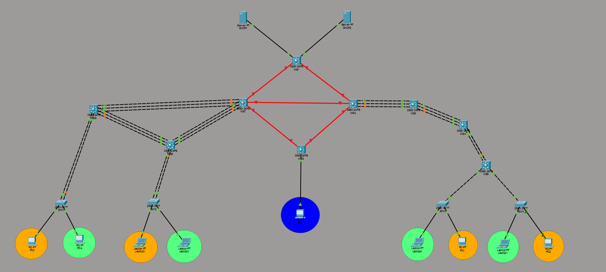

# Proyecto 1 - Chapin Red
### Redes de Computadoras 2 | Universidad San Carlos de Guatemala
**Estudiante** Estiben Yair Lopz Leveron
**Carné:** 202204578  
**Curso:** Redes de Computadoras 2  
**Semestre:** 1S 2026  

---

## Índice
1. [Descripción del Proyecto](#descripción-del-proyecto)
2. [Topología de Red](#topología-de-red)
3. [Fase 1 - Planificación y Subnetting](#fase-1---planificación-y-subnetting)
4. [VLANs](#vlans)
5. [VTP - VLAN Trunking Protocol](#vtp---vlan-trunking-protocol)
6. [Agregación de Enlaces (LACP y PAgP)](#agregación-de-enlaces-lacp-y-pagp)
7. [Enrutamiento Dinámico (OSPF)](#enrutamiento-dinámico-ospf)
8. [DHCP](#dhcp)
9. [ACLs - Control de Acceso](#acls---control-de-acceso)
10. [Comandos Principales](#comandos-principales)

---

## Descripción del Proyecto

**Chapin Red** es una empresa dedicada a proyectos de ayuda humanitaria que opera desde cuatro edificios distribuidos geográficamente. Este proyecto implementa una red corporativa multi-edificio con:

- Arquitectura jerárquica de tres capas (Core, Distribución, Acceso)
- Segmentación mediante VLANs
- Agregación de enlaces con LACP y PAgP
- Enrutamiento dinámico con OSPF (carné par)
- Servidores DHCP centralizados
- Políticas de seguridad con ACLs

---

## Topología de Red


### Dispositivos utilizados

| Switch | Modelo | Rol | Edificio |
|--------|--------|-----|----------|
| MS1 | Cisco 3650-24PS | MAN - Switch Central | Central |
| MS7 | Cisco 3650-24PS | MAN - Switch Izquierdo | Izquierdo |
| MS2 | Cisco 3650-24PS | MAN - Switch Derecho | Derecho |
| MS6 | Cisco 3650-24PS | MAN - Switch Admin | Admin |
| MS9 | Cisco 3560-24PS | Core | Izquierdo |
| MS8 | Cisco 3560-24PS | Distribución | Izquierdo |
| MS4 | Cisco 3560-24PS | Core/Distribución | Derecho |
| MS5 | Cisco 3560-24PS | Distribución | Derecho |
| SW1 | Cisco 2960 | Acceso | Izquierdo |
| SW2 | Cisco 2960 | Acceso | Izquierdo |
| SW3 | Cisco 2960 | Acceso | Derecho |
| SW4 | Cisco 2960 | Acceso | Derecho |

---

## Fase 1 - Planificación y Subnetting

### ¿Qué es el Subnetting?

El subnetting consiste en tomar una red grande y dividirla en subredes más pequeñas. Cada subred agrupa dispositivos con funciones similares, mejorando la seguridad y el rendimiento de la red.

### Redes Base Asignadas

Mi Carnet es **202204578** termina en **78**, por lo tanto:

| Red | Dirección | Uso |
|-----|-----------|-----|
| Red 1 | `192.188.78.0/24` | VLANs de usuarios |
| Red 2 | `10.4.78.0/24` | Enlaces punto a punto entre switches/routers |

El prefijo **/24** indica que hay **254 hosts disponibles** por red:
- Total de IPs: 2⁸ = 256
- Menos red (`.0`) y broadcast (`.255`) = **254 hosts útiles**

### Técnica utilizada: VLSM (Variable Length Subnet Mask)

VLSM permite asignar máscaras de diferente longitud a cada subred según la cantidad de hosts que necesita. Esto optimiza el uso del espacio de direccionamiento.

---

### Parte A: Subnetting de VLANs — `192.188.78.0/24`

Se necesitan **5 subredes**, una por cada VLAN. Se ordenan de mayor a menor para aplicar VLSM correctamente.

#### Cálculo de máscaras:

**Para /27 (VLANs grandes):**
```
Bits de host = 32 - 27 = 5 bits
Total IPs    = 2⁵ = 32
Hosts útiles = 32 - 2 = 30 hosts
Máscara      = 255.255.255.224
```

**Para /28 (VLAN ADMIN):**
```
Bits de host = 32 - 28 = 4 bits
Total IPs    = 2⁴ = 16
Hosts útiles = 16 - 2 = 14 hosts
Máscara      = 255.255.255.240
```

#### Tabla de subredes para VLANs:

| # | VLAN | Red | Máscara | Gateway | Rango DHCP | Broadcast | Hosts |
|---|------|-----|---------|---------|------------|-----------|-------|
| 1 | VLAN 10 - Naranja IZQ | 192.188.78.0/27 | 255.255.255.224 | 192.188.78.1 | .2 → .30 | 192.188.78.31 | 30 |
| 2 | VLAN 20 - Verde IZQ | 192.188.78.32/27 | 255.255.255.224 | 192.188.78.33 | .34 → .62 | 192.188.78.63 | 30 |
| 3 | VLAN 30 - Naranja DER | 192.188.78.64/27 | 255.255.255.224 | 192.188.78.65 | .66 → .94 | 192.188.78.95 | 30 |
| 4 | VLAN 40 - Verde DER | 192.188.78.96/27 | 255.255.255.224 | 192.188.78.97 | .98 → .126 | 192.188.78.127 | 30 |
| 5 | VLAN 99 - ADMIN | 192.188.78.128/28 | 255.255.255.240 | 192.188.78.129 | .130 → .142 | 192.188.78.143 | 14 |

---

### Parte B: Subnetting de enlaces — `10.4.78.0/24`

Los enlaces punto a punto entre switches multicapa usan subredes **/30**, que proveen exactamente 2 hosts útiles (uno para cada extremo del enlace).

**Para /30:**
```
Bits de host = 32 - 30 = 2 bits
Total IPs    = 2² = 4
Hosts útiles = 4 - 2 = 2 hosts
Máscara      = 255.255.255.252
```

#### Tabla de enlaces punto a punto:

| # | Enlace | Red | IP Lado A | IP Lado B | Broadcast |
|---|--------|-----|-----------|-----------|-----------|
| 1 | MS1 ↔ MS7 | 10.4.78.0/30 | 10.4.78.1 (MS1) | 10.4.78.2 (MS7) | 10.4.78.3 |
| 2 | MS1 ↔ MS2 | 10.4.78.4/30 | 10.4.78.5 (MS1) | 10.4.78.6 (MS2) | 10.4.78.7 |
| 3 | MS1 ↔ MS3 | 10.4.78.8/30 | 10.4.78.9 (MS1) | 10.4.78.10 (MS3) | 10.4.78.11 |
| 4 | MS7 ↔ MS6 | 10.4.78.12/30 | 10.4.78.13 (MS7) | 10.4.78.14 (MS6) | 10.4.78.15 |
| 5 | MS2 ↔ MS6 | 10.4.78.16/30 | 10.4.78.17 (MS2) | 10.4.78.18 (MS6) | 10.4.78.19 |
| 6 | MS3 ↔ MS6 | 10.4.78.20/30 | 10.4.78.21 (MS3) | 10.4.78.22 (MS6) | 10.4.78.23 |
| 7 | MS7 ↔ MS9 | 10.4.78.24/30 | 10.4.78.25 (MS7) | 10.4.78.26 (MS9) | 10.4.78.27 |
| 8 | MS7 ↔ MS8 | 10.4.78.28/30 | 10.4.78.29 (MS7) | 10.4.78.30 (MS8) | 10.4.78.31 |
| 9 | MS9 ↔ MS8 | 10.4.78.32/30 | 10.4.78.33 (MS9) | 10.4.78.34 (MS8) | 10.4.78.35 |
| 10 | MS2 ↔ MS4 | 10.4.78.36/30 | 10.4.78.37 (MS2) | 10.4.78.38 (MS4) | 10.4.78.39 |
| 11 | MS3 ↔ MS4 | 10.4.78.40/30 | 10.4.78.41 (MS3) | 10.4.78.42 (MS4) | 10.4.78.43 |
| 12 | MS4 ↔ MS5 | 10.4.78.44/30 | 10.4.78.45 (MS4) | 10.4.78.46 (MS5) | 10.4.78.47 |

---

## VLANs

### Numeración y nomenclatura

Los nombres siguen la convención requerida: `VLAN_[Color]_Edificio[IZQ/DER]_[Carnet]`

| VLAN ID | Nombre | Departamento | Edificio |
|---------|--------|--------------|----------|
| 10 | VLAN_Naranja_EdificioIZQ_202204578 | Proyectos | Izquierdo |
| 20 | VLAN_Verde_EdificioIZQ_202204578 | Coordinación | Izquierdo |
| 30 | VLAN_Naranja_EdificioDER_202204578 | Proyectos | Derecho |
| 40 | VLAN_Verde_EdificioDER_202204578 | Coordinación | Derecho |
| 99 | VLAN_ADMIN_202204578 | Administración | Admin |
---

## VTP - VLAN Trunking Protocol

VTP permite sincronizar automáticamente la configuración de VLANs entre todos los switches del dominio, evitando configurarlas manualmente en cada dispositivo.

## Configuracion Vlans

**configuracion MS1 Vlan**
```
enable
configure terminal

vlan 10 
name VLAN_Naranja_EdificioIZQ_202204578
exit

vlan 20
name VLAN_Verde_EdificioIZQ_202204578

vlan 30
name VLAN_Naranja_EdificioDER_202204578
exit

vlan 40
name VLAN_Verde_EdificioDER_202204578
exit

vlan 99
name VLAN_ADMIN_202204578
exit

end
write memory

```


### trunks por switch
**MS1 a DCHP1, DHCP2, MS7 Y MS2**
```
interface gigabitEthernet 1/1/2
switchport trunk encapsulation dot1q
switchport mode trunk
switchport trunk allowed vlan 10,20,30,40,99
no shutdown
exit


interface gigabitEthernet 1/1/1  ← hacia MS2
switchport mode trunk
switchport trunk allowed vlan 10,20,30,40,99
no shutdown
exit


! Hacia DHCP1
interface gigabitEthernet 1/0/1
switchport mode access
switchport access vlan 99
no shutdown
exit

! Hacia DHCP2
interface gigabitEthernet 1/0/2
switchport mode access
switchport access vlan 99
no shutdown
exit
```

**MS7 a MS1, MS2, MS6, MS9 Y MS8**
```
enable
configure terminal

! Hacia MS1 (Red MAN)
interface gigabitEthernet 1/1/2
switchport mode trunk
switchport trunk allowed vlan 10,20,30,40,99
no shutdown
exit

! Hacia MS2 (Red MAN)
interface gigabitEthernet 1/1/3
switchport mode trunk
switchport trunk allowed vlan 10,20,30,40,99
no shutdown
exit

! Hacia MS6 (Red MAN)
interface gigabitEthernet 1/1/1
switchport mode trunk
switchport trunk allowed vlan 10,20,30,40,99
no shutdown
exit

! Hacia MS9 (Edificio Izquierdo)
interface gigabitEthernet X/X/X
switchport mode trunk
switchport trunk allowed vlan 10,20,30,40,99
no shutdown
exit

! Hacia MS8 (Edificio Izquierdo)
interface gigabitEthernet X/X/X
switchport mode trunk
switchport trunk allowed vlan 10,20,30,40,99
no shutdown
exit

end
write memory
```

**MS2 a MS6, MS1, MS7, MS3**

```

enable
configure terminal
interface gigabitEthernet 1/1/1
switchport mode trunk
switchport trunk allowed vlan 10,20,30,40,99
no shutdown
exit

interface gigabitEthernet 1/1/2
switchport mode trunk
switchport trunk allowed vlan 10,20,30,40,99
no shutdown
exit

interface gigabitEthernet 1/1/3
switchport mode trunk
switchport trunk allowed vlan 10,20,30,40,99
no shutdown
exit
exit
write memory
```

**MS6 a MS2, MS7**
```
enable
configure terminal
interface gigabitEthernet 1/1/1
switchport mode trunk
switchport trunk allowed vlan 10,20,30,40,99
no shutdown
exit


interface gigabitEthernet 1/1/2
switchport mode trunk
switchport trunk allowed vlan 10,20,30,40,99
no shutdown
exit


! Hacia PC0 → access VLAN 99 Admin
interface GigabitEthernet1/0/10
switchport mode access
switchport access vlan 99
no shutdown
exit


exit
write memory

```

### Configuración VTP

| Parámetro | Valor |
|-----------|-------|
| Dominio | ChapinRed |
| Contraseña | 123 |
| Versión | 2 |

### Roles VTP

| Switch | Rol VTP | Motivo |
|--------|---------|--------|
| MS1 ,MS7, MS2, | **Server** | Switch central, propaga VLANs a toda la red |
| MS9, MS8, MS4, MS5, MS6| Client | Switches internos de edificios |
| SW1, SW2, SW3, SW4 | Client | Switches de acceso |

### Comandos VTP

**En MS1 (Servidor):**
```
enable
configure terminal
hostname MS1
vtp mode server
vtp domain ChapinRed
vtp password chapin123
vtp version 2
end
write memory
```


**En MS7 (Servidor)**
```
enable
configure terminal
hostname MS7
vtp mode server
vtp domain ChapinRed
vtp password chapin123
vtp version 2
end
write memory
```


**En MS2 (Servidor)**
```
enable
configure terminal
hostname MS2
vtp mode server
vtp domain ChapinRed
vtp password chapin123
vtp version 2
end
write memory
```

**En MS6 (cliente)**
```
enable
configure terminal
hostname MS6
vtp mode client
vtp domain ChapinRed
vtp password chapin123
vtp version 2
end
write memory
```

**En MS9 (cliente)**
```
enable
configure terminal
hostname MS9
vtp mode client
vtp domain ChapinRed
vtp password chapin123
vtp version 2
end
write memory
```

**En MS8 (cliente)**
```
enable
configure terminal
hostname MS8
vtp mode client
vtp domain ChapinRed
vtp password chapin123
vtp version 2
end
write memory
```

**En MS3 (cliente)**
```
enable
configure terminal
hostname MS3
vtp mode client
vtp domain ChapinRed
vtp password chapin123
vtp version 2
end
write memory
```

**En MS4 (cliente)**
```
enable
configure terminal
hostname MS4
vtp mode client
vtp domain ChapinRed
vtp password chapin123
vtp version 2
end
write memory
```

**En MS5 (cliente)**
```
enable
configure terminal
hostname MS5
vtp mode client
vtp domain ChapinRed
vtp password chapin123
vtp version 2
end
write memory
```

**En SW1 (cliente)**
```
enable
configure terminal
hostname SW1
vtp mode client
vtp domain ChapinRed
vtp password chapin123
vtp version 2
end
write memory
```

**En SW2 (cliente)**
```
enable
configure terminal
hostname SW2
vtp mode client
vtp domain ChapinRed
vtp password chapin123
vtp version 2
end
write memory
```

**En SW3 (cliente)**
```
enable
configure terminal
hostname SW3
vtp mode client
vtp domain ChapinRed
vtp password chapin123
vtp version 2
end
write memory
```

**En SW4 (cliente)**
```
enable
configure terminal
hostname SW4
vtp mode client
vtp domain ChapinRed
vtp password chapin123
vtp version 2
end
write memory
```

**Verificación:**
```
show vtp status
```

---

## Agregación de Enlaces (LACP y PAgP)

La agregación de enlaces combina múltiples conexiones físicas en un único enlace lógico, aumentando el ancho de banda y proporcionando redundancia.

### LACP — Edificio Izquierdo (5 enlaces)

LACP (Link Aggregation Control Protocol) es el estándar IEEE 802.3ad, compatible con cualquier fabricante.


### COMANDO LACP

**MS9**
```
enable
configure terminal

! Hacia MS7 → channel-group 1
interface range GigabitEthernet1/0/1 - 3
channel-group 1 mode active
no shutdown
exit
interface port-channel 1
switchport mode trunk
switchport trunk allowed vlan 10,20,30,40,99
no shutdown
exit

! Hacia MS8 → channel-group 3
interface range GigabitEthernet1/0/7 - 9
channel-group 3 mode active
no shutdown
exit
interface port-channel 3
switchport mode trunk
switchport trunk allowed vlan 10,20,30,40,99
no shutdown
exit

! Hacia SW1 → channel-group 5
interface range GigabitEthernet1/0/4 - 5
channel-group 5 mode active
no shutdown
exit
interface port-channel 5
switchport mode trunk
switchport trunk allowed vlan 10,20,30,40,99
no shutdown
exit

end
write memory
```


**MS7**
```
enable
configure terminal

! Hacia MS9 → channel-group 1
interface range GigabitEthernet1/0/1 - 3
channel-group 1 mode active
no shutdown
exit
interface port-channel 1
switchport mode trunk
switchport trunk allowed vlan 10,20,30,40,99
no shutdown
exit

! Hacia MS8 → channel-group 2
interface range GigabitEthernet1/0/4 - 6
channel-group 2 mode active
no shutdown
exit
interface port-channel 2
switchport mode trunk
switchport trunk allowed vlan 10,20,30,40,99
no shutdown
exit

end
write memory
```

**MS8**
```
enable
configure terminal

! Hacia MS9 → channel-group 3
interface range GigabitEthernet1/0/7 - 9
channel-group 3 mode active
no shutdown
exit
interface port-channel 3
switchport mode trunk
switchport trunk allowed vlan 10,20,30,40,99
no shutdown
exit

! Hacia MS7 → channel-group 2
interface range GigabitEthernet1/0/4 - 6
channel-group 2 mode active
no shutdown
exit
interface port-channel 2
switchport mode trunk
switchport trunk allowed vlan 10,20,30,40,99
no shutdown
exit

! Hacia SW2 → channel-group 4
interface range GigabitEthernet1/0/1 - 2
channel-group 4 mode active
no shutdown
exit
interface port-channel 4
switchport mode trunk
switchport trunk allowed vlan 10,20,30,40,99
no shutdown
exit

end
write memory
```

**SW1**
```
enable
configure terminal

! Hacia MS9 → channel-group 5
interface range GigabitEthernet0/1 - 2
channel-group 5 mode active
no shutdown
exit
interface port-channel 5
switchport mode trunk
switchport trunk allowed vlan 10,20,30,40,99
no shutdown
exit

! Hacia PC1 → VLAN 10 Naranja
interface FastEthernet0/1
switchport mode access
switchport access vlan 10
no shutdown
exit

! Hacia PC2 → VLAN 10 VERDE
interface FastEthernet0/2
switchport mode access
switchport access vlan 20
no shutdown
exit

end
write memory
```

**SW2**
```
enable
configure terminal

! Hacia MS8 → channel-group 4
interface range GigabitEthernet0/1 - 2
channel-group 4 mode active
no shutdown
exit
interface port-channel 4
switchport mode trunk
switchport trunk allowed vlan 10,20,30,40,99
no shutdown
exit

! Hacia Laptop0 → VLAN 10 Naranja
interface FastEthernet0/10
switchport mode access
switchport access vlan 20
no shutdown
exit

! Hacia Laptop1 → VLAN 20 Verde
interface FastEthernet0/11
switchport mode access
switchport access vlan 20
no shutdown
exit

end
write memory
```
### PAgP — Edificio Derecho (3 enlaces)

PAgP (Port Aggregation Protocol) es el protocolo propietario de Cisco.

**MS3**
```
enable
configure terminal

! Hacia MS3 → Po1
interface range GigabitEthernet1/0/1 - 3
channel-group 1 mode desirable
no shutdown
exit
interface port-channel 1
switchport mode trunk
switchport trunk allowed vlan 10,20,30,40,99
no shutdown
exit

end
write memory
```
**MS3**
```
enable
configure terminal

! Hacia MS2 → Po1
interface range GigabitEthernet1/0/1 - 3
channel-group 1 mode desirable
no shutdown
exit
interface port-channel 1
switchport mode trunk
switchport trunk allowed vlan 10,20,30,40,99
no shutdown
exit

! Hacia MS4 → Po2
interface range GigabitEthernet1/0/4 - 6
channel-group 2 mode desirable
no shutdown
exit
interface port-channel 2
switchport mode trunk
switchport trunk allowed vlan 10,20,30,40,99
no shutdown
exit

end
write memory
```


**MS4**
```
enable
configure terminal

! Hacia MS3 → Po2
interface range GigabitEthernet1/0/4 - 6
channel-group 2 mode desirable
no shutdown
exit
interface port-channel 2
switchport mode trunk
switchport trunk allowed vlan 10,20,30,40,99
no shutdown
exit

! Hacia MS5 → Po3
interface range GigabitEthernet1/0/1 - 3
channel-group 3 mode desirable
no shutdown
exit
interface port-channel 3
switchport mode trunk
switchport trunk allowed vlan 10,20,30,40,99
no shutdown
exit

end
write memory

```
**MS5**
```
enable
configure terminal

! Hacia MS4 → Po3
interface range GigabitEthernet1/0/1 - 3
channel-group 3 mode desirable
no shutdown
exit
interface port-channel 3
switchport mode trunk
switchport trunk allowed vlan 10,20,30,40,99
no shutdown
exit

! Hacia SW3 → trunk normal
interface GigabitEthernet1/0/10
switchport mode trunk
switchport trunk allowed vlan 10,20,30,40,99
no shutdown
exit

! Hacia SW4 → trunk normal
interface GigabitEthernet1/0/11
switchport mode trunk
switchport trunk allowed vlan 10,20,30,40,99
no shutdown
exit

end
write memory
```

**SW3**
```
enable
configure terminal

! Hacia MS5 → trunk
interface GigabitEthernet0/1
switchport mode trunk
switchport trunk allowed vlan 10,20,30,40,99
no shutdown
exit

! Hacia Laptop2 → VLAN 40 Verde
interface FastEthernet0/10
switchport mode access
switchport access vlan 40
no shutdown
exit

! Hacia PC3 → VLAN 30 Naranja
interface FastEthernet0/11
switchport mode access
switchport access vlan 30
no shutdown
exit

end
write memory
```

**SW4**
```
enable
configure terminal

! Hacia MS5 → trunk
interface GigabitEthernet0/1
switchport mode trunk
switchport trunk allowed vlan 10,20,30,40,99
no shutdown
exit

! Hacia Laptop3 → VLAN 40 Verde
interface FastEthernet0/10
switchport mode access
switchport access vlan 40
no shutdown
exit

! Hacia PC4 → VLAN 30 Naranja
interface FastEthernet0/11
switchport mode access
switchport access vlan 30
no shutdown
exit

end
write memory
```

**Verificación de EtherChannels:**
```
show etherchannel summary
show etherchannel detail
```


---

## Enrutamiento Dinámico (OSPF)

OSPF (Open Shortest Path First) es el protocolo asignado para carné par (202204578). Calcula las rutas más eficientes basándose en el costo de los enlaces.

### Configuración OSPF en switches multicapa

```
configure terminal
ip routing
router ospf 1
network [red] [wildcard] area 0
end
write memory
```

**MS1**
```
enable
configure terminal

ip routing

! Hacia MS7
interface GigabitEthernet 1/1/2
no switchport
ip address 10.4.78.1 255.255.255.252
no shutdown
exit

! Hacia MS2
interface GigabitEthernet 1/1/1
no switchport
ip address 10.4.78.5 255.255.255.252
no shutdown
exit

end
write memory
```

**Verificación:**
```
show ip ospf neighbor
show ip route ospf
```

---

## DHCP

El protocolo DHCP asigna automáticamente direcciones IP a los dispositivos finales.

### Servidor DHCP Izquierdo (DHCP1)

Atiende las VLANs del edificio izquierdo:

| Pool | Red | Gateway | Rango |
|------|-----|---------|-------|
| VLAN10_Naranja_IZQ | 192.188.78.0/27 | 192.188.78.1 | .2 → .30 |
| VLAN20_Verde_IZQ | 192.188.78.32/27 | 192.188.78.33 | .34 → .62 |

### Servidor DHCP Derecho (DHCP2)

Atiende las VLANs del edificio derecho:

| Pool | Red | Gateway | Rango |
|------|-----|---------|-------|
| VLAN30_Naranja_DER | 192.188.78.64/27 | 192.188.78.65 | .66 → .94 |
| VLAN40_Verde_DER | 192.188.78.96/27 | 192.188.78.97 | .98 → .126 |
| VLAN99_ADMIN | 192.188.78.128/28 | 192.188.78.129 | .130 → .142 |

### DHCP Relay (IP Helper)

Permite que las solicitudes DHCP de los dispositivos lleguen al servidor aunque estén en diferente subred.

```
interface vlan [ID]
ip helper-address [IP_SERVIDOR_DHCP]
```

---

## ACLs - Control de Acceso

Las ACLs (Access Control Lists) controlan qué tráfico puede pasar entre VLANs, implementando las políticas de seguridad de la empresa.

### Políticas requeridas

| VLAN origen | VLAN destino | ¿Permitido? |
|-------------|--------------|-------------|
| Naranja IZQ | Naranja DER | Sí |
| Naranja | Verde |  No |
| Naranja | ADMIN |  No |
| Verde IZQ | Verde DER |  Sí |
| Verde | Naranja |  No |
| Verde | ADMIN |  No |
| ADMIN | Cualquier VLAN |  Sí (puede iniciar) |
| Cualquier VLAN | ADMIN |  No (no puede iniciar hacia ADMIN) |

### Implementación técnica

```
! ACL para VLAN Naranja - solo permite comunicación entre Naranjas
ip access-list extended ACL_NARANJA
 permit ip 192.188.78.0 0.0.0.31 192.188.78.64 0.0.0.31
 permit ip 192.188.78.64 0.0.0.31 192.188.78.0 0.0.0.31
 deny ip any any

! ACL para VLAN Verde - solo permite comunicación entre Verdes
ip access-list extended ACL_VERDE
 permit ip 192.188.78.32 0.0.0.31 192.188.78.96 0.0.0.31
 permit ip 192.188.78.96 0.0.0.31 192.188.78.32 0.0.0.31
 deny ip any any

! ACL para VLAN ADMIN - bloquea tráfico entrante desde otras VLANs
ip access-list extended ACL_ADMIN_IN
 deny ip 192.188.78.0 0.0.0.31 192.188.78.128 0.0.0.15
 deny ip 192.188.78.32 0.0.0.31 192.188.78.128 0.0.0.15
 deny ip 192.188.78.64 0.0.0.31 192.188.78.128 0.0.0.15
 deny ip 192.188.78.96 0.0.0.31 192.188.78.128 0.0.0.15
 permit ip any any
```

---

## Comandos Principales

### Comandos de verificación generales

| Comando | Descripción |
|---------|-------------|
| `show vtp status` | Verifica configuración VTP |
| `show vlan brief` | Lista todas las VLANs |
| `show interfaces trunk` | Muestra puertos en modo trunk |
| `show etherchannel summary` | Estado de los EtherChannels |
| `show ip ospf neighbor` | Vecinos OSPF activos |
| `show ip route` | Tabla de enrutamiento |
| `show ip interface brief` | Estado de interfaces |
| `show access-lists` | Muestra las ACLs configuradas |

### Comandos de configuración de VLANs

```
vlan [ID]
name [NOMBRE]
exit
```

### Configuración de puertos Access y Trunk

```
! Puerto Access
interface FastEthernet0/X
switchport mode access
switchport access vlan [ID]
spanning-tree portfast
no shutdown

! Puerto Trunk
interface GigabitEthernet1/0/X
switchport mode trunk
switchport trunk allowed vlan [IDs]
no shutdown
```
## Configuración de interfaces de capa 3 (SVI)

### ¿Por qué estas SVIs en estos switches?

El enunciado define tres capas jerárquicas para el edificio izquierdo:
- **Core (MS9):** conecta hacia la MAN (MS7) y hacia Distribución (MS8)
- **Distribución (MS8):** conecta hacia Acceso
- **Acceso (SW1, SW2):** conecta dispositivos finales

Sin embargo, en la topología implementada **MS9 conecta directamente a SW1** 
(verificado con `show cdp neighbors`), por lo que MS9 actúa como gateway de 
los dispositivos de SW1. MS8 conecta directamente a SW2, pero dado que MS9 
ya maneja el inter-VLAN routing de ambas VLANs (10 y 20), MS8 solo necesita 
`ip routing` para participar en OSPF y reenviar tráfico.

### Sintaxis general
```
interface vlan [ID]
ip address [IP] [MASCARA]
no shutdown
```

---

### MS9 (Core - Edificio Izquierdo)
Gateway de SW1. Maneja inter-VLAN routing de VLAN 10 y VLAN 20.
```
enable
configure terminal

ip routing

! SVI VLAN 10 - Naranja IZQ - gateway de PC1
interface vlan 10
ip address 192.188.78.1 255.255.255.224
no shutdown
exit

! SVI VLAN 20 - Verde IZQ - gateway de PC2
interface vlan 20
ip address 192.188.78.33 255.255.255.224
no shutdown
exit

end
write memory
```

---

### MS8 (Distribución - Edificio Izquierdo)
Conecta a SW2 y a MS9. No actúa como gateway de VLANs de usuario
ya que MS9 maneja el inter-VLAN routing. Solo requiere `ip routing`
para participar en OSPF.
```
enable
configure terminal

ip routing

end
write memory
```

---

### MS5 (Distribución - Edificio Derecho)
Gateway de SW3 y SW4. Maneja inter-VLAN routing de VLAN 30 y VLAN 40.
```
enable
configure terminal

ip routing

! SVI VLAN 30 - Naranja DER - gateway de PC3, PC4
interface vlan 30
ip address 192.188.78.65 255.255.255.224
no shutdown
exit

! SVI VLAN 40 - Verde DER - gateway de Laptop2, Laptop3
interface vlan 40
ip address 192.188.78.97 255.255.255.224
no shutdown
exit

end
write memory
```

---

### MS6 (Edificio Administración)
Gateway de PC0 Admin. Maneja la VLAN 99 exclusiva del departamento 
de administración.
```
enable
configure terminal

ip routing

! SVI VLAN 99 - ADMIN - gateway de PC0 Admin
interface vlan 99
ip address 192.188.78.129 255.255.255.240
no shutdown
exit

end
write memory
```

*Proyecto 1 - Chapin Red | Redes de Computadoras 2 | USAC 2026*